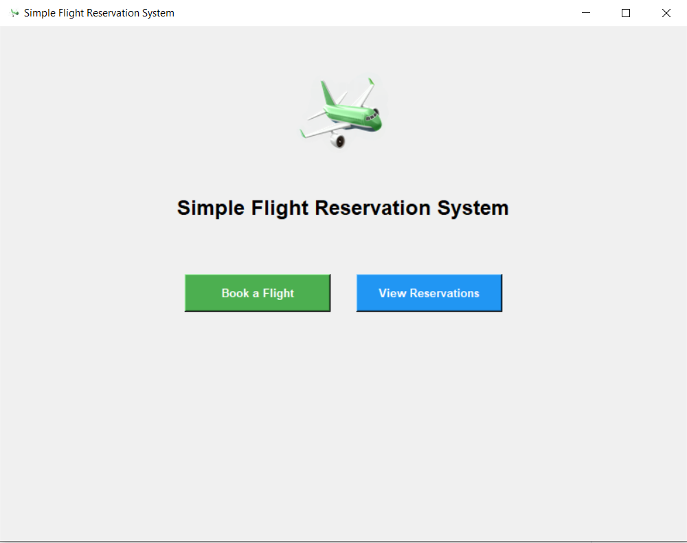
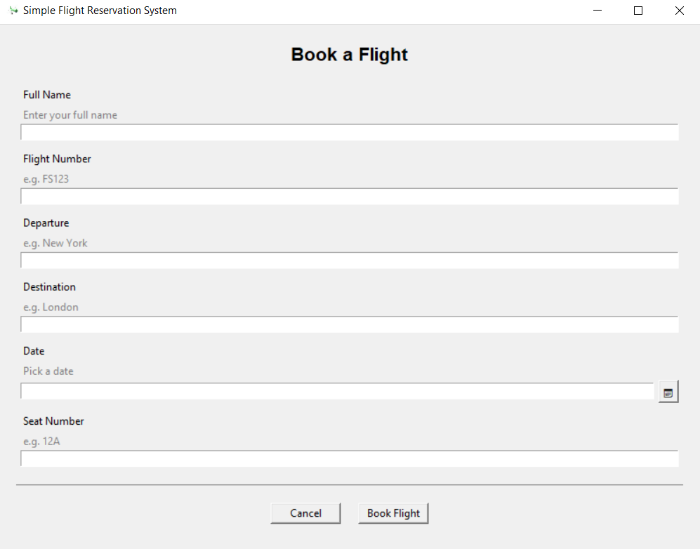
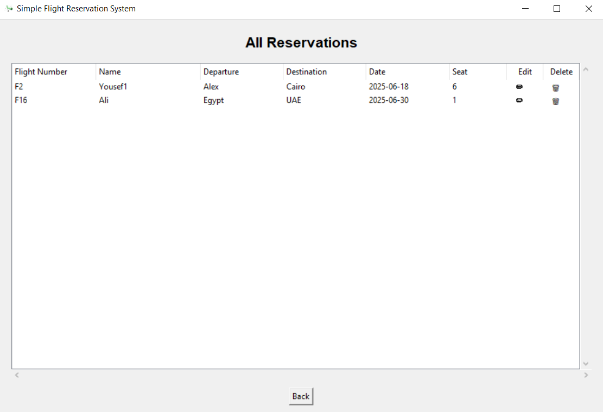
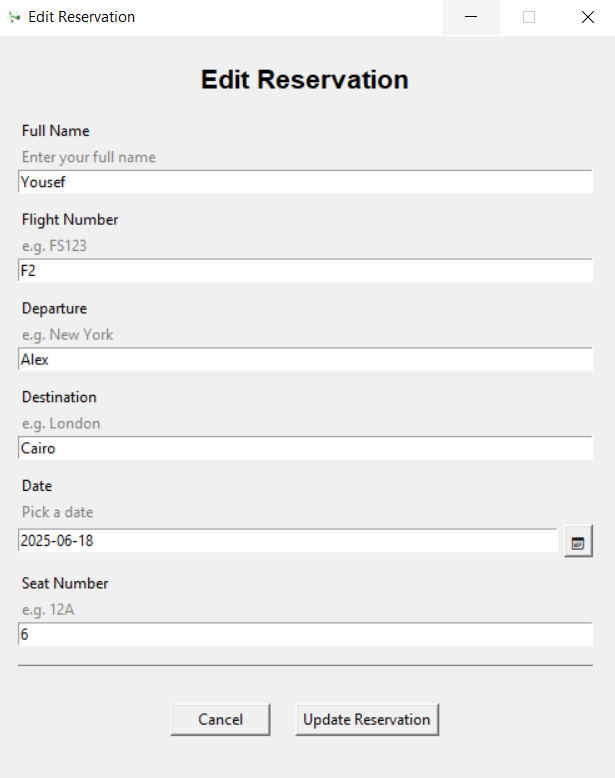

# Flight Reservation App

A simple desktop application for managing flight reservations built with Python, Tkinter, and SQLite.

## Screenshots

### 🏠 Home Page



### 🛫 Book a Flight



### 📋 View Reservations



### ✏️ Update Existing Reservation



---

## Prerequisites

* **Python 3.7+** installed on your system  
* **pip** (Python package installer)

---

## Setup and Installation

1. **Clone the repository**

   ```bash
   git clone https://github.com/muhammadgalhoum/flight-reservation-app.git
   cd flight-reservation-app


2. **Create a virtual environment**

   * **Windows**:

     ```powershell
     python -m venv venv
     ```

   * **macOS/Linux**:

     ```bash
     python3 -m venv venv
     ```

3. **Activate the virtual environment**

   * **Windows**:

     ```cmd
     .\venv\Scripts\activate
     ```

   * **macOS/Linux**:

     ```bash
     source venv/bin/activate
     ```

4. **Install dependencies**

   ```bash
   pip install -r requirements.txt
   ```

## Running the Application

With the virtual environment activated, start the app:

```bash
python main.py
```

The app will launch its Tkinter GUI and use the `data/flights.db` file for all CRUD operations.

---

## Building the Standalone Executable

To generate a Windows `.exe` file:

1. **Run the build script**:

   ```bash
   ./build.sh
   ```

   * This will produce a `dist/FlightBooking/` folder containing:

     ```text
     dist/FlightBooking/
     ├── FlightBooking.exe
     ├── assets/
     │   └── logo.png
     └── data/
         └── flights.db
     ```

2. **Run the executable**
   * Double-click `FlightBooking.exe` to run the app.

---

## Key Features and Constraints

* ✅ **Unique Reservations**: Prevents duplicate bookings by enforcing a unique constraint on `(flight_number, date, seat_number)`. No two passengers can book the same seat on the same flight and date.
* 📅 **Custom Date Picker**: Includes a built-in date picker widget (`custom_date_picker.py`) that avoids external dependencies (like `tkcalendar`) and ensures compatibility and ease of use.
* 🔒 **Date Validation**: Users cannot select or enter past dates. Reservations are limited to today or future dates only.
